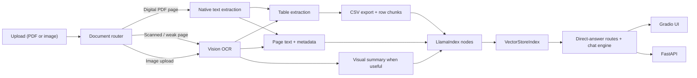

# DocQA

Parser-first document question answering for real-world PDFs and images.

DocQA is a single-document RAG application built for the messy cases that break toy demos: handwritten registers, scanned forms, table-heavy PDFs, mixed image/text pages, research papers, receipts, and ordinary digital documents. It routes each PDF page through native text extraction first, falls back to vision OCR only when needed, indexes the extracted content with LlamaIndex, and exposes both a chat UI and a local REST API.

The project is intentionally conservative about cross-table joins. If the document does not preserve a reliable key between two table groups, DocQA says so instead of inventing a relationship.

## Why this project exists

Most document chat demos assume one of two worlds:

- everything is clean, digital, and easy to parse
- everything is OCR, even when native extraction would be faster and more accurate

This project sits in the middle. It is designed for mixed-quality documents and routes content page by page:

- born-digital PDF page -> native parsing
- weak or scanned PDF page -> OCR fallback
- image upload -> OCR plus visual understanding

That keeps clean PDFs fast, preserves support for handwritten material, and makes the system more honest about what it can and cannot safely infer.

## What it handles well

- Handwritten and scanned PDFs
- Standalone images such as receipts, screenshots, and photographed documents
- Born-digital PDFs with extractable text
- Mixed PDFs where some pages are digital and others are scanned
- Table-heavy workflows such as registers, ledgers, and budget sheets
- Overview questions like "What is this document about?"
- Page-scoped questions like "What is on page 4?"
- Visual questions like "What does this image show?"
- Full-table synthesis questions like "List all owners and phone numbers"

## Core features

- Parser-first PDF routing with OCR fallback
- LlamaIndex-based retrieval over page text, visual summaries, and table rows
- Gradio UI for interactive chat
- FastAPI endpoint for local testing and automation
- Table extraction to CSV and downloadable ZIP export
- Page-aware source reporting
- Conservative cross-table linkage logic
- OpenAI-first workflow with Gemini support

## Architecture



## Quickstart

### Prerequisites

- Python 3.11+
- Poppler for PDF rasterization
- At least one API key:
  - `OPENAI_API_KEY`
  - `GEMINI_API_KEY`

Poppler installation:

```bash
# macOS
brew install poppler
```

```bash
# Ubuntu / Debian
sudo apt-get update
sudo apt-get install -y poppler-utils
```

### Installation

```bash
git clone <your-repo-url>
cd docqa
python -m venv .venv
source .venv/bin/activate
pip install -r requirements.txt
cp .env.example .env
```

Then edit `.env` and add at least one API key.

### Configuration

Environment variables:

| Variable | Required | Default | Purpose |
|---|---:|---|---|
| `OPENAI_API_KEY` | No | empty | Primary provider for OCR and QA |
| `GEMINI_API_KEY` | No | empty | Alternative provider |
| `GRADIO_SHARE` | No | `false` | Enable Gradio public share link |
| `OPEN_BROWSER` | No | `true` | Open the UI in the browser on launch |
| `DOCQA_SERVER_HOST` | No | `127.0.0.1` | UI/API host |
| `DOCQA_SERVER_PORT` | No | `7860` | Gradio UI port |
| `DOCQA_API_PORT` | No | `7861` | FastAPI port |
| `DOCQA_WORK_DIR` | No | `/tmp/docqa_v3` | Temporary working directory for extracted artifacts |

Provider selection:

- If both keys are present, OpenAI is used by default
- You can override with `BACKEND=openai` or `BACKEND=gemini`

## Running the app

### Gradio UI

```bash
python app.py
```

The UI starts on `http://127.0.0.1:7860` by default.

### REST API

```bash
python api.py
```

The API starts on `http://127.0.0.1:7861` by default.

## API usage

### Health check

```bash
curl http://127.0.0.1:7861/health
```

### Ingest a document

```bash
curl -X POST http://127.0.0.1:7861/api/ingest \
  -F "file=@./path/to/document.pdf"
```

Example response:

```json
{
  "session_id": "8d0f1c8d7a1b4c7d9f2a4f7a4d2f4f91",
  "doc_name": "document.pdf",
  "summary": "Veterinary register with owner, animal, diagnosis, and treatment records.",
  "page_count": 5,
  "routing": {
    "digital_pages": 0,
    "ocr_pages": 5,
    "native_table_pages": 0
  }
}
```

### Query a session

```bash
curl -X POST http://127.0.0.1:7861/api/query \
  -H "Content-Type: application/json" \
  -d '{
    "session_id": "YOUR_SESSION_ID",
    "question": "What does this document contain?"
  }'
```

### Inspect a session

```bash
curl http://127.0.0.1:7861/api/sessions/YOUR_SESSION_ID
```

### Delete a session

```bash
curl -X DELETE http://127.0.0.1:7861/api/sessions/YOUR_SESSION_ID
```

## Query modes

The app does not answer every question through the same path.

- Overview route:
  - used for "what is this document about?" style questions
- Visual route:
  - used for image-centric questions
- Synthesis route:
  - used for full-table or full-document structured questions
- Relationship route:
  - used when the user is asking the app to link values across table groups
- Standard retrieval route:
  - used for normal document-grounded chat

This split is deliberate. A single top-k retriever is not reliable enough for all five behaviors.

## Parser-first routing

For PDFs, DocQA evaluates each page independently:

1. Attempt native text extraction
2. Score extraction quality
3. Keep native text if it is strong enough
4. Fall back to OCR only for weak or scanned pages

This makes a big difference:

- clean PDFs avoid unnecessary OCR
- scanned and handwritten pages still work
- mixed documents can use both paths in one upload

## Cross-table joins

Cross-table joins are intentionally conservative.

If two table groups do not share a reliable key, DocQA will not pretend they do. Instead, it will:

- explain that the join is unsafe
- return separate evidence
- avoid hallucinating relationships between rows

This is especially important for OCR-heavy registers where one page contains owner rows and another page contains clinical rows, but the stable linking key is partially lost during extraction.

## Repository layout

```text
docqa/
├── api.py
├── app.py
├── config.py
├── engine.py
├── history.py
├── indexer.py
├── ocr.py
├── prompts.py
├── renderer.py
├── requirements.txt
├── service.py
├── .env.example
├── ARCHITECTURE.md
└── tests/
```

Current entry points:

- `app.py` -> Gradio UI
- `api.py` -> FastAPI service
- `service.py` -> reusable ingest/query layer

## Development notes

Useful checks:

```bash
python -m py_compile app.py api.py service.py ocr.py indexer.py engine.py
```

```bash
curl http://127.0.0.1:7861/health
```

## Known limitations

- One active document per session
- No authentication or multi-user isolation
- OCR quality still determines quality on poor scans
- Native table extraction is intentionally lightweight and may not recover every complex digital layout
- The Gradio chatbot currently uses tuple-style history internally and still emits a deprecation warning; this does not affect correctness

## Roadmap

- Move the Gradio chat state to message-format history
- Strengthen native table extraction for complex digital PDFs
- Add stronger page-level confidence scoring
- Expand automated evaluation against a broader test set of scanned and table-heavy documents

## Publishing checklist

Before uploading this repository to GitHub:

- add a license
- rotate any API keys you have ever pasted into a terminal log
- confirm `.env` is ignored
- decide whether to keep or remove legacy experimental files

